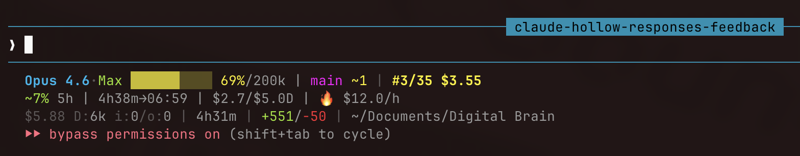

# claude-code-statusline

A customizable 3-line statusline for [Claude Code](https://docs.anthropic.com/en/docs/claude-code).



## What it shows

```
Line 1: Model·Auth ▓▓▓░░ 50%/200k | git-branch +staged ~modified | [vim]
Line 2: ~14% 5h | 4h12m→01:59 | $5.2/$237.9D | 🔥 $8.5/h        (optional)
Line 3: $0.52 D:352k i:3k/o:8k cR:14.0M | 2m30s | +156/-23 | ~/project
```

**Line 1** — Model, auth mode, context window usage, git status, vim mode

**Line 2** — 5-hour billing block: usage %, time remaining, daily cost, burn rate (optional, requires [ccusage](https://github.com/ryoppippi/ccusage))

**Line 3** — Session cost, token metrics, session duration, lines changed, working directory

## Quick start

1. Copy `statusline.sh` to `~/.claude/`:

```bash
cp statusline.sh ~/.claude/statusline.sh
chmod +x ~/.claude/statusline.sh
```

2. Add to `~/.claude/settings.json`:

```json
{
  "statusLine": {
    "type": "command",
    "command": "~/.claude/statusline.sh",
    "padding": 0
  }
}
```

3. Restart Claude Code.

### Optional: 5h billing widget

```bash
npm i -g ccusage
cp ccusage-widget.sh ~/.claude/ccusage-widget.sh
chmod +x ~/.claude/ccusage-widget.sh
```

The statusline will automatically pick it up. If `ccusage` is not installed, Line 2 is simply skipped.

## Features

### Context progress bar

Color-coded by usage:
- **Green** — below 50%
- **Yellow** — 50% to 79%
- **Red** — 80% and above

Auto-detects 200k vs 1M context window.

### Auth mode detection

| Badge | Meaning | How it's detected |
|-------|---------|-------------------|
| `Max` (green) | Claude Max subscription | No API key env vars set |
| `API` (yellow) | Direct API key | `ANTHROPIC_API_KEY` or `ANTHROPIC_AUTH_TOKEN` set |
| `API@host` (yellow) | API proxy | Above + `ANTHROPIC_BASE_URL` set |

### Git integration

Shows current branch, staged file count, and modified file count. Uses a 5-second file cache to avoid running `git` on every refresh.

### Token metrics

| Label | Scope | What it counts |
|-------|-------|----------------|
| `D:` | All sessions today | `input_tokens + output_tokens` (non-cache) |
| `i:` | Current session | `input_tokens` (non-cache) |
| `o:` | Current session | `output_tokens` |
| `cR:` | Current session | `cache_read_input_tokens` (shown only when > 0) |
| `cW:` | Current session | `cache_creation_input_tokens` (shown only when > 0) |

Reads from local JSONL files in `~/.claude/projects/`. Cached for 60 seconds.

### 5h billing block (optional)

Requires the [ccusage](https://github.com/ryoppippi/ccusage) CLI. Shows:
- Usage percentage against your plan's 5h block limit
- Time remaining in current block
- Session cost / daily cost
- Burn rate with indicator: 🟢 < $1.5/h, 🟡 < $5/h, 🔥 >= $5/h

Edit `BLOCK_LIMIT` in `ccusage-widget.sh` to match your plan:
- Pro: `18`
- Max5: `35` (default)
- Max20: `140`

## Customization

This is a plain bash script. Read it, change it, make it yours.

### Change the progress bar characters

Line 39-40 — replace `▓` and `░` with whatever you like:

```bash
bar=$(printf "%${filled}s" | tr ' ' '█')    # solid blocks
bar="${bar}$(printf "%${empty}s" | tr ' ' '·')"  # dots
```

### Remove the billing line

Delete or comment out line 107:

```bash
# billing=$("$(dirname "$0")/ccusage-widget.sh" 2>/dev/null)
```

### Remove token metrics

Delete lines 91-104 and simplify the output on line 112 to remove `${tok_str}`.

### Add your own metrics

The script receives JSON via stdin from Claude Code. Available fields:

```json
{
  "model": { "display_name": "Opus 4.6" },
  "context_window": {
    "used_percentage": 42,
    "context_window_size": 200000
  },
  "cost": {
    "total_cost_usd": 1.23,
    "total_duration_ms": 150000,
    "total_lines_added": 156,
    "total_lines_removed": 23
  },
  "workspace": { "current_dir": "/Users/you/project" },
  "vim": { "mode": "NORMAL" },
  "session_id": "abc123"
}
```

Extract what you need with `jq` and add it to the output.

## Caching strategy

| Cache | Path | TTL | Contents |
|-------|------|-----|----------|
| Git | `/tmp/sl-git-cache` | 5s | `branch\|staged\|modified` |
| Tokens | `/tmp/sl-tok-cache` | 60s | Daily and session token counts |
| Billing | `/tmp/ccusage-widget.txt` | 30s | 5h block usage data |

## Dependencies

- **jq** (required) — JSON parsing
- **git** (optional) — branch and status display
- **ccusage** (optional) — 5h billing block (`npm i -g ccusage`)
- **bc** (optional, macOS built-in) — burn rate calculation

## Testing

```bash
echo '{"model":{"display_name":"Opus 4.6"},"session_id":"test","context_window":{"used_percentage":50,"context_window_size":200000},"cost":{"total_cost_usd":0.52,"total_duration_ms":150000,"total_lines_added":156,"total_lines_removed":23},"workspace":{"current_dir":"'$HOME'/project"},"vim":{}}' | ./statusline.sh
```

## Platform notes

- Tested on macOS. The `stat -f %m` and `date -j` flags are macOS-specific.
- For Linux, replace `stat -f %m` with `stat -c %Y` and adjust the `date` commands.

## License

MIT
